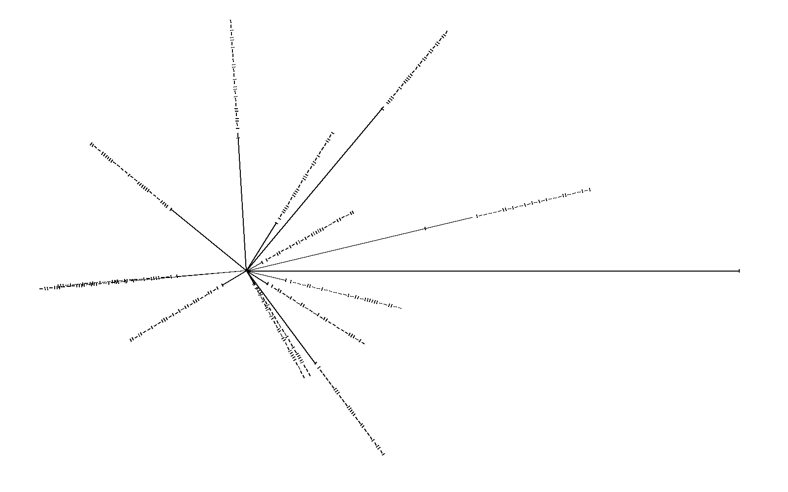
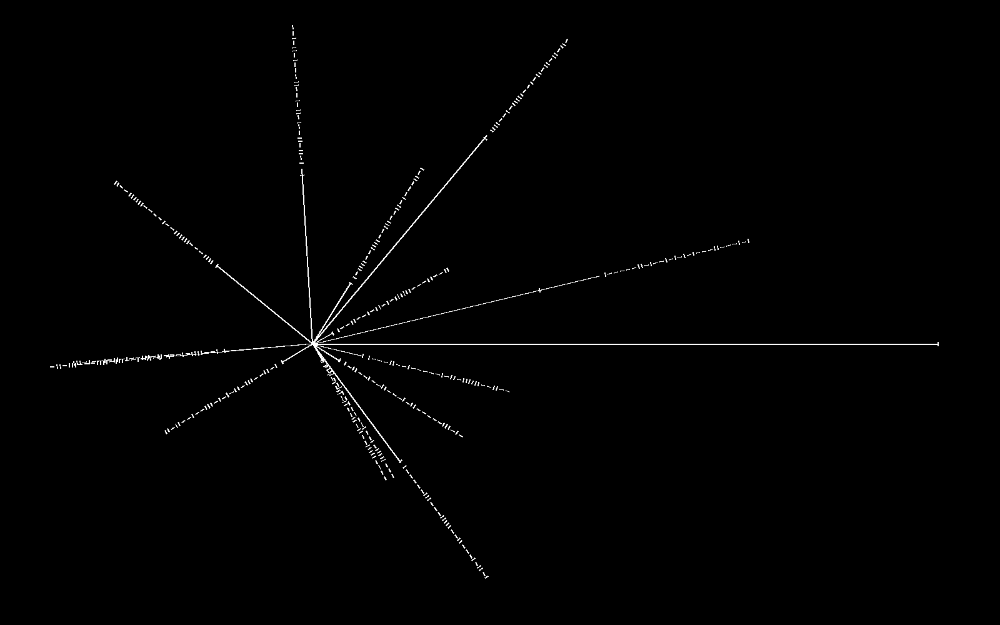
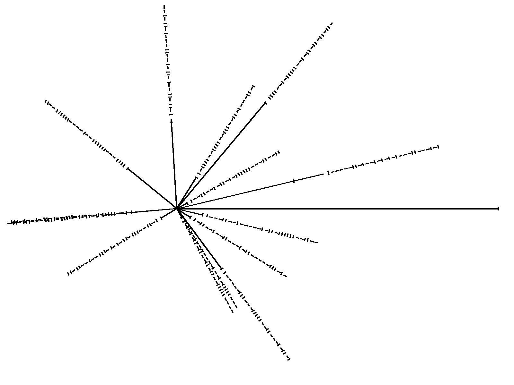
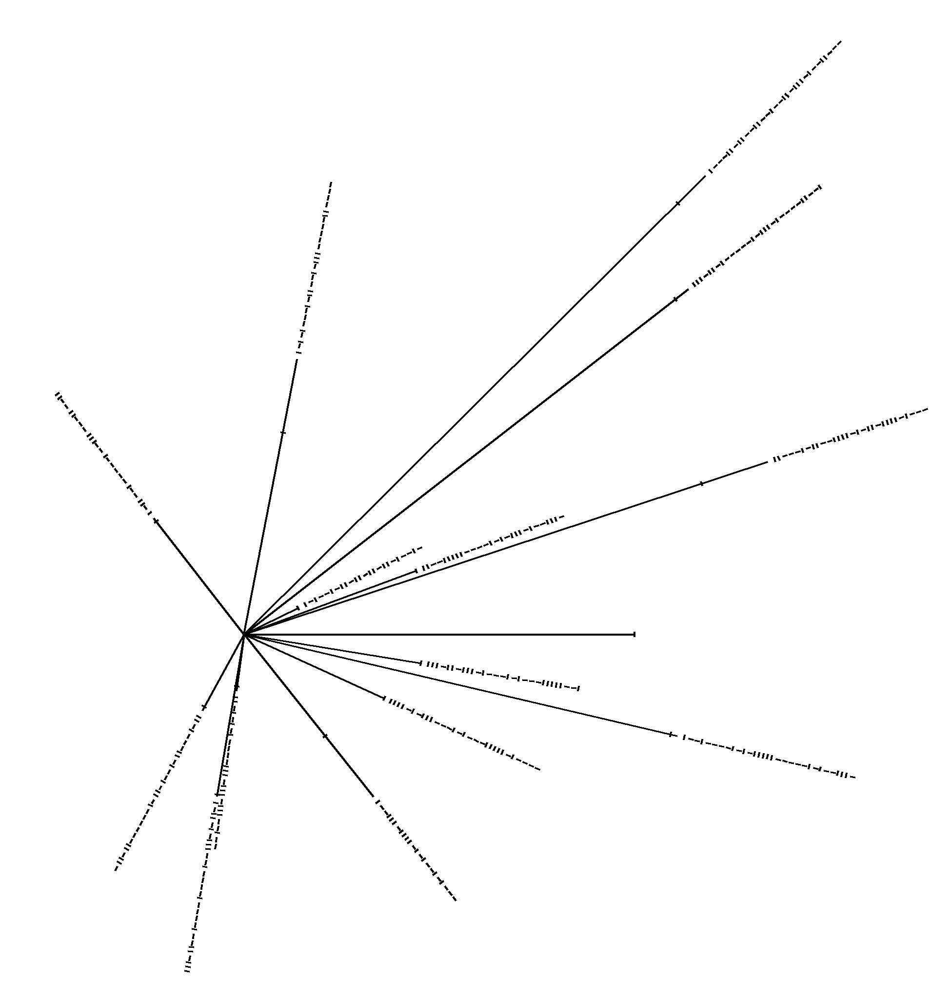
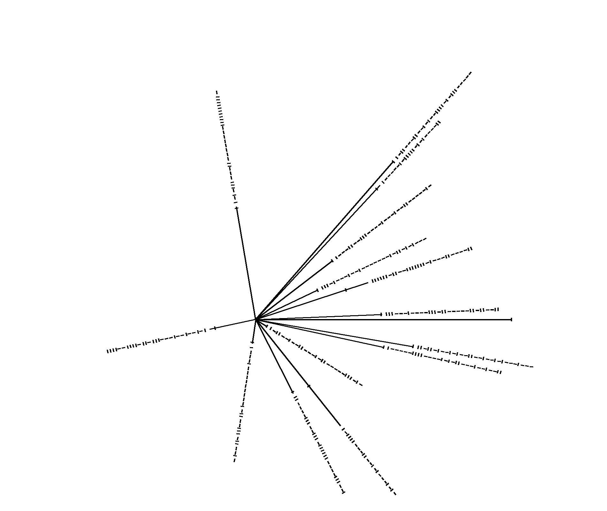
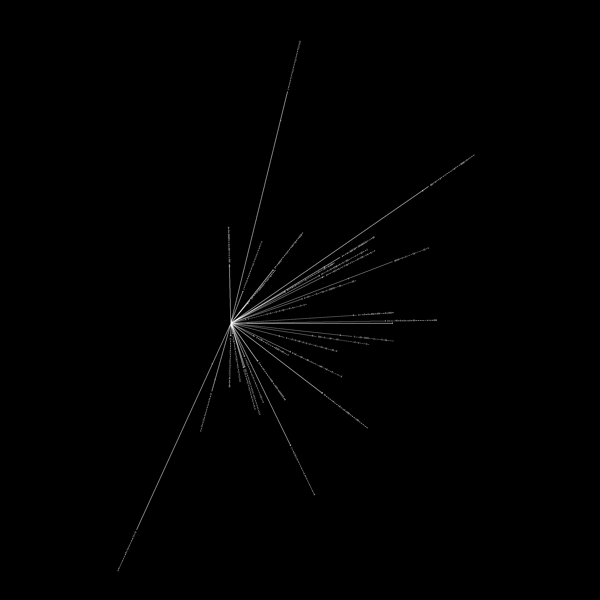

# pulsar-maps-python

## Create your own pulsar maps in Python

Re-create the original pulsar map from the Voyager spacecrafts:

```python
PulsarMap()
```


Change the colour for the defult map:

```python
PulsarMap(tick_colour='white', line_colour='white', bc_colour='black')
```


Change line & tick width, the origin, and the image dimensions:

```python
PulsarMap(height=1200, m_point = (550,650), line_width=4, tick_len=10)
```


Use different pulsars from the Australian Telescope National Facility (ATNF) database:

```python
new_pulsars = ['J1857+0526','J0205+6449','J0820-3921','J1918-0642','J1843-1507','J0533-4524','J0820-1350',
               'J0024-7204P','J1623-4949','J1705-3936','J1720-3659','J1921+1006g','J2156+2618','J1828-1007']

PulsarMap(pulsars=new_pulsars, height=2050, width=1950, m_point=(500,1300), gc_len=800, line_width=4, tick_len=10)
```


Another example with different pulsars:
```python
new_pulsars2 = ['J1731-4744','J1456-6843','J1243-6423','J0835-4510','J0953+0755','J0826+2637','J0534+2200',
                'J0528+2200','J0332+5434','J2219+4754','J2018+2839','J1935+1616','J1932+1059','J1645-0317']

PulsarMap(pulsars=new_pulsars2, height=1600, width=1900, m_point=(800,1000), gc_len=800, line_width=4, tick_len=10)
```


Using 30 random pulsars, create a pulsar map:

```python
new_pulsars3 = ['J1803-6707','J2021+3651','J1604-3142','J1737-0314D','J1236-65','J1819-1318','J1928-0548',
                'J1844-0302','J1936+18','J1616-5017','J1748-2446P','J0954-5754','J1826-1131','J0931-1902',
                'J1835-0349','J1747-2809','J0514-4002A','J2006+4058','J1851+0233','J1701-3006B','J1630+3550',
                'J2115+5448','J0944-1354','J1021-5601','J1744-3922','J1138-6207','J1044-5737','J1843-0000',
                'J0820-4114','J1515-5720']

PulsarMap(pulsars=new_pulsars3, height=2600, width=2600, m_point=(1000,1400), gc_len=700, line_width=2, tick_len=6, tick_colour='white', line_colour='white', bc_colour='black')
```


**A massive thank you to the [psrqpy Python module](https://github.com/mattpitkin/psrqpy/) and the [Australian Telescope National Facility](https://www.atnf.csiro.au/) pulsar database for making this project possible.**
